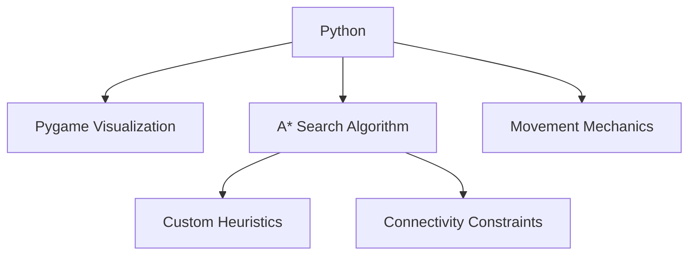

# 🧩 Programmable Matter Simulation

<div align="center">


**Transform matter with intelligent algorithms. Reimagine physical computing.**

Features • Installation • Usage • How It Works • Demo


</div>

## 🌟 Overview

This project simulates the fascinating concept of **programmable matter** - material that can change its physical properties on demand. Our implementation uses an advanced AI planning system to reconfigure connected units into target shapes while maintaining connectivity constraints.


## ✨ Features

- **🔄 Dynamic Reconfiguration** - Transform matter from any initial shape to complex target configurations
- **🧠 Intelligent Pathfinding** - Advanced A* search algorithm with custom heuristics ensures optimal movement
- **🔗 Connectivity Preservation** - Maintains unbroken connections between matter elements during transformation
- **🎮 Interactive Controls** - Multiple control modes for hands-on experimentation
- **📊 Real-Time Visualization** - Watch the transformation process unfold using Pygame

## 🛠️ Technology Stack



| Component | Implementation | Description |
|-----------|----------------|-------------|
| Core Engine | Python 3.8+ | Handles simulation logic and state management |
| Visualization | Pygame | Provides real-time interactive rendering |
| AI Planning | Custom A* | Plans optimal reconfiguration paths |
| Movement | 8-directional | Supports cardinal and diagonal movement |

## 📦 Installation

```bash
# Clone the repository
git clone https://github.com/yourusername/programmable-matter.git
cd programmable-matter

# Create and activate virtual environment (optional)
python -m venv venv
source venv/bin/activate   # On Windows: venv\Scripts\activate

# Install dependencies
pip install -r requirements.txt

# Run the simulation
python src/main.py
```

## 🎮 Controls

### ⌨️ Mode Selection
- <kbd>Tab</kbd> - Toggle between uniform and individual modes
- <kbd>M</kbd> - Enter target shape selection mode
- <kbd>T</kbd> - Activate AI transformation mode

### 🏃‍♂️ Uniform Mode (All blocks move together)
- <kbd>↑</kbd> <kbd>↓</kbd> <kbd>←</kbd> <kbd>→</kbd> - Move cardinal directions
- <kbd>Q</kbd> <kbd>E</kbd> <kbd>Z</kbd> <kbd>C</kbd> - Move diagonally

### 👆 Individual Mode (Move selected blocks)
- <kbd>R</kbd> <kbd>F</kbd> - Select previous/next block
- <kbd>W</kbd> <kbd>A</kbd> <kbd>S</kbd> <kbd>D</kbd> - Move selected block

### 🎯 Target Selection Mode
- <kbd>Mouse Click</kbd> - Add/remove cells from target shape
- <kbd>S</kbd> - Save target shape

### ⚙️ AI Controls
- <kbd>+</kbd> <kbd>-</kbd> - Adjust animation speed

## 🧠 How It Works

Our AI planner employs a sophisticated **A* search algorithm** with several optimizations:

1. **State Representation** - Each configuration is represented as a set of coordinates
2. **Connectivity Enforcement** - BFS algorithm ensures all blocks remain connected
3. **Movement Generation** - Four types of moves are considered:
   - Uniform moves (all blocks together)
   - Single block moves (leaf nodes)
   - Pair moves (adjacent blocks)
   - Group moves (3-4 connected blocks)

```python
# Example: Checking state connectivity using BFS
def is_state_connected(state):
    visited = set()
    queue = deque([state[0]])
    visited.add(state[0])
    
    while queue:
        current = queue.popleft()
        for neighbor in get_neighbors(current, state):
            if neighbor not in visited:
                visited.add(neighbor)
                queue.append(neighbor)
                
    return len(visited) == len(state)  # All blocks reachable?
```

## 📋 Project Structure

```
📂 programmable_matter/
│
├── 📂 src/                      # Source code
│   ├── 📜 main.py               # Entry point
│   ├── 📜 grid.py               # Grid and movement logic
│   ├── 📜 visualizer.py         # Pygame visualization
│   └── 📜 ai_agent.py           # A* search implementation
│
├── 📂 tests/                    # Unit tests
│   ├── 📜 test_grid.py
│   ├── 📜 test_movement.py
│   └── 📜 test_connectivity.py
│
├── 📂 docs/                     # Documentation
├── 📂 examples/                 # Example configurations
└── 📜 requirements.txt          # Dependencies
```


## 🚀 Future Work

- **Physics-Based Simulation** - Add realistic physics constraints to movement
- **3D Extension** - Expand the system to three dimensions
- **Parallelized Search** - Implement distributed planning algorithms
- **Hardware Implementation** - Bridge to physical modular robots

## 👥 Contributors

This project was developed as part of the COE 544 course at The Lebanese American University.

## 📄 License

This project is licensed under the MIT License - see the LICENSE file for details.

---

<div align="center">
  <p>
    <i>Inspired by the concept of programmable matter in the Terminator Movie Franchise</i>
  </p>
</div>
